# Diagramme de Cas d'Utilisation - Projet Capgemini NextJS

## Diagramme Mermaid

```mermaid
graph TB
    %% Acteurs
    subgraph "Acteurs Externes"
        U[Utilisateur Non Authentifié]
        UA[Utilisateur Authentifié]
        A[Administrateur]
        S[Système IA]
        F[Firebase Auth]
        G[GitHub API]
        N[Netlify API]
        D[DeepSeek API]
    end

    %% Système principal
    subgraph "Système Capgemini Workspace"
        subgraph "Interface Utilisateur"
            HP[Page d'Accueil]
            DASH[Dashboard]
            CONT[Page Contact]
            GUIDE[Page Guide]
        end

        subgraph "Fonctionnalités Principales"
            GEN[Génération de Projets]
            PLAN[Planification IA]
            EDIT[Éditeur de Code]
            UML[Générateur UML]
            CHAT[Chatbot IA]
            EXP[Export de Projets]
            DEP[Déploiement]
        end

        subgraph "Fonctionnalités Admin"
            AUTH[Gestion Emails Autorisés]
            STATS[Statistiques]
            CONFIG[Configuration Système]
        end

        subgraph "Services Backend"
            API[API Routes]
            DB[Base de Données]
            AUTH_SVC[Service d'Authentification]
            LLM_SVC[Service LLM]
            UML_SVC[Service UML]
        end
    end

    %% Relations Utilisateur Non Authentifié
    U --> HP
    U --> CONT
    U --> GUIDE
    U --> |S'inscrire/Se connecter| F
    U --> |Décrire projet| GEN

    %% Relations Utilisateur Authentifié
    UA --> DASH
    UA --> |Créer un prompt| PLAN
    UA --> |Générer un projet| GEN
    UA --> |Éditer du code| EDIT
    UA --> |Générer UML| UML
    UA --> |Interagir avec IA| CHAT
    UA --> |Exporter projet| EXP
    UA --> |Déployer projet| DEP
    UA --> |Sauvegarder plans| PLAN
    UA --> |Consulter historique| DASH
    UA --> |Rechercher dans le code| CHAT
    UA --> |Modifier fichiers| EDIT

    %% Relations Administrateur
    A --> AUTH
    A --> STATS
    A --> CONFIG
    A --> |Ajouter emails autorisés| AUTH
    A --> |Supprimer emails autorisés| AUTH
    A --> |Consulter statistiques| STATS
    A --> |Configurer système| CONFIG

    %% Relations Système IA
    S --> |Analyser prompt| PLAN
    S --> |Générer code| GEN
    S --> |Répondre questions| CHAT
    S --> |Expliquer code| CHAT
    S --> |Modifier code| CHAT

    %% Relations APIs Externes
    D --> |Génération de code| GEN
    G --> |Créer repository| DEP
    G --> |Push code| DEP
    N --> |Déployer application| DEP
    F --> |Authentification| AUTH_SVC

    %% Relations Internes
    GEN --> API
    PLAN --> API
    EDIT --> API
    UML --> API
    CHAT --> API
    EXP --> API
    DEP --> API
    AUTH --> API

    API --> DB
    API --> AUTH_SVC
    API --> LLM_SVC
    API --> UML_SVC

    %% Styles
    classDef actor fill:#e1f5fe,stroke:#01579b,stroke-width:2px
    classDef system fill:#f3e5f5,stroke:#4a148c,stroke-width:2px
    classDef feature fill:#e8f5e8,stroke:#1b5e20,stroke-width:2px
    classDef admin fill:#fff3e0,stroke:#e65100,stroke-width:2px
    classDef service fill:#fce4ec,stroke:#880e4f,stroke-width:2px

    class U,UA,A,S,F,G,N,D actor
    class HP,DASH,CONT,GUIDE system
    class GEN,PLAN,EDIT,UML,CHAT,EXP,DEP feature
    class AUTH,STATS,CONFIG admin
    class API,DB,AUTH_SVC,LLM_SVC,UML_SVC service
```

## Description des Cas d'Utilisation

### 👤 **Acteurs Principaux**

#### **Utilisateur Non Authentifié**
- **Accéder à la page d'accueil** : Consulter les fonctionnalités et statistiques
- **Consulter le guide** : Lire la documentation d'utilisation
- **Contacter le support** : Envoyer un message via le formulaire de contact
- **S'inscrire/Se connecter** : Authentification via Google Firebase
- **Décrire un projet** : Créer un prompt pour générer un projet (redirection vers dashboard après authentification)

#### **Utilisateur Authentifié**
- **Accéder au dashboard** : Interface principale de travail
- **Créer un prompt** : Décrire un projet pour génération automatique
- **Générer un projet** : Créer automatiquement la structure et le code
- **Éditer du code** : Modifier les fichiers générés via l'éditeur intégré
- **Générer des diagrammes UML** : Analyser le code et créer des diagrammes
- **Interagir avec le chatbot IA** : Poser des questions et demander des modifications
- **Exporter un projet** : Télécharger le projet au format ZIP
- **Déployer un projet** : Publier sur GitHub et/ou Netlify
- **Sauvegarder des plans** : Conserver les plans de projets
- **Consulter l'historique** : Voir les projets précédents
- **Rechercher dans le code** : Utiliser les commandes de recherche du chatbot
- **Modifier des fichiers** : Édition en temps réel avec onglets multiples

#### **Administrateur**
- **Gérer les emails autorisés** : Ajouter/supprimer des utilisateurs autorisés
- **Consulter les statistiques** : Voir les métriques d'utilisation
- **Configurer le système** : Paramétrer les fonctionnalités

### 🤖 **Acteurs Système**

#### **Système IA (Agents)**
- **Analyser les prompts** : Comprendre et structurer les demandes utilisateur
- **Générer du code** : Créer automatiquement le code source
- **Répondre aux questions** : Assistance via le chatbot
- **Expliquer le code** : Clarifier le fonctionnement des fichiers
- **Modifier le code** : Apporter des corrections automatiques

#### **APIs Externes**
- **DeepSeek API** : Génération de code intelligent
- **GitHub API** : Gestion des repositories et push de code
- **Netlify API** : Déploiement automatique d'applications
- **Firebase Auth** : Authentification sécurisée

### 🔧 **Fonctionnalités Système**

#### **Interface Utilisateur**
- **Page d'Accueil** : Présentation et formulaire de génération
- **Dashboard** : Interface principale de travail
- **Page Contact** : Formulaire de support
- **Page Guide** : Documentation utilisateur

#### **Fonctionnalités Principales**
- **Génération de Projets** : Création automatique complète
- **Planification IA** : Structuration intelligente des projets
- **Éditeur de Code** : Édition en temps réel avec Monaco
- **Générateur UML** : Analyse et diagrammes automatiques
- **Chatbot IA** : Assistant intelligent intégré
- **Export de Projets** : Téléchargement au format ZIP
- **Déploiement** : Publication automatique

#### **Fonctionnalités Administratives**
- **Gestion Emails Autorisés** : Contrôle d'accès
- **Statistiques** : Métriques d'utilisation
- **Configuration Système** : Paramétrage avancé

#### **Services Backend**
- **API Routes** : Endpoints Next.js
- **Base de Données** : Stockage Firestore
- **Service d'Authentification** : Gestion des sessions
- **Service LLM** : Intégration des modèles IA
- **Service UML** : Génération de diagrammes

### 🔄 **Flux Principaux**

1. **Création de Projet** : Utilisateur → Prompt → IA → Génération → Dashboard
2. **Édition de Code** : Dashboard → Éditeur → Sauvegarde → Prévisualisation
3. **Assistance IA** : Utilisateur → Chatbot → Analyse → Réponse/Modification
4. **Déploiement** : Projet → GitHub → Netlify → URL publique
5. **Gestion Admin** : Admin → Panel → Configuration → Système

Ce diagramme de cas d'utilisation couvre l'ensemble des fonctionnalités du projet Capgemini NextJS, montrant les interactions entre tous les acteurs et les différentes parties du système. 